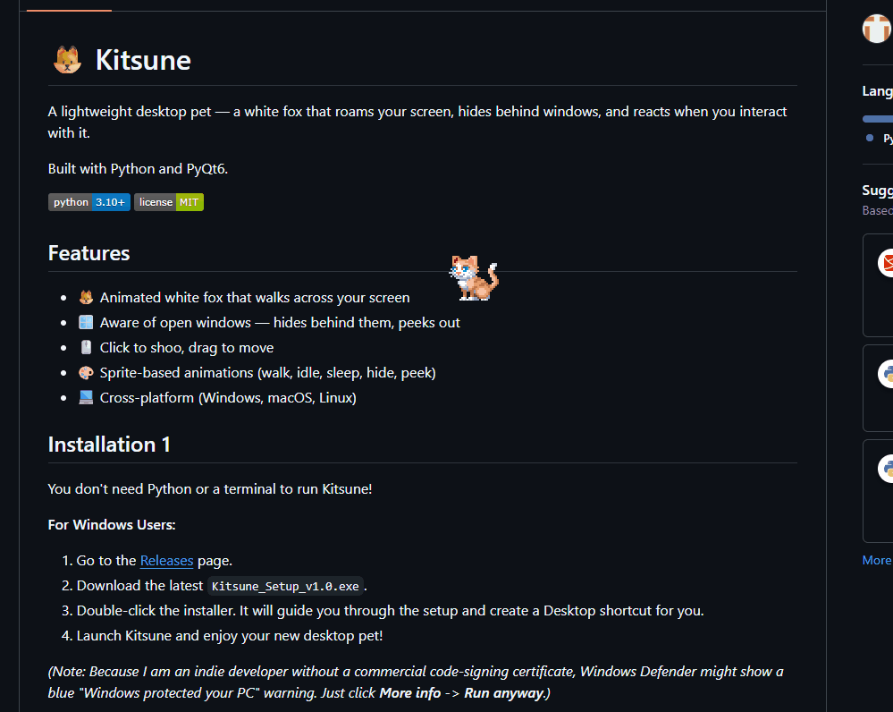

# Kitsune 🦊

Kitsune is a desktop pet app – a white fox that roams the user's screen. It's also a learning project for CI/CD, testing, mutation testing, and modern development workflows. The fox hides behind OS windows, peeks out, walks around, sleeps, and can be clicked to shoo it away or dragged to move it.




## Download

Grab the latest Windows installer from the [Releases page](https://github.com/FHolmstroem/Kitsune/releases).

Run the setup wizard and Kitsune will install like any other app — no Python required.

## Features

- Transparent overlay — the fox walks on top of your desktop
- State machine AI — idles, walks, runs, and flees when clicked
- Click to shoo, drag to move
- Right click to start mini game to chase cursor
- System tray icon with quit option
- Keyboard shortcut: `Ctrl+Q` to quit

## Run from source

Requires Python 3.11+ on Linux or Windows.

```bash
# Clone and enter the repo
git clone git@github.com:FHolmstroem/Kitsune.git
cd Kitsune

# Create and activate a virtual environment
python -m venv venv
source venv/bin/activate      # Linux/macOS
venv\Scripts\activate         # Windows

# Install dependencies
pip install PyQt6 PyGetWindow

# Run
python src/main.py
```

Quit with `Ctrl+Q` (anywhere) or `Ctrl+C` (in the terminal).

## Build the Windows installer yourself

```bash
# 1. Freeze with PyInstaller
pyinstaller --noconsole --name Kitsune --paths src \
    --add-data "assets/sprites;assets/sprites" src/main.py

# 2. Compile the installer with Inno Setup
#    Open installer_script.iss in Inno Setup and hit Compile.
#    Output lands in build_installer/Kitsune_Setup_v1.0.exe
```

## Run tests

```bash
# Headless (no display needed)
QT_QPA_PLATFORM=offscreen PYTHONPATH=src pytest tests/ -v
```

## Mutation Testing
We use mutmut (v3) for mutation testing, run inside WSL Debian. Config lives in pyproject.toml.

```bash
wsl -d Debian
source venv/bin/activate
mutmut run
mutmut results
```

## Project structure

```
src/
├── main.py             Entry point, wires everything together
├── overlay.py          Transparent always-on-top Qt window
├── pet.py              Fox state machine (idle, walk, flee, etc.)
├── animation.py        Sprite sheet loading and frame cycling
├── window_manager.py   OS window detection via PyGetWindow
└── interactions.py     Mouse event handling (click, drag, shoo)

assets/sprites/         Sprite sheets (walk, run, idle)
tests/                  pytest suite (runs headless)
```

## Roadmap

- [x] Transparent overlay with sprite rendering
- [x] State machine with walking, idling, and fleeing
- [x] Click to shoo, drag to move
- [x] Real sprite art integrated
- [x] Windows installer via PyInstaller + Inno Setup
- [ ] Fox hides behind OS windows
- [ ] Custom app icon (.ico)
- [ ] Sleep animation after long idle
- [ ] More personality (random behaviors, reactions)

## AI Assistance
This project is built with help from Google Gemini and Anthropic Claude.

## Credits

- **Cat sprites** by [xzany](https://xzany.itch.io/cat-2d-pixel-art) — 2D Pixel Art Cat asset pack. Used under the author's license (see `assets/sprites/LICENSE.txt`).

## License

[MIT](LICENSE)